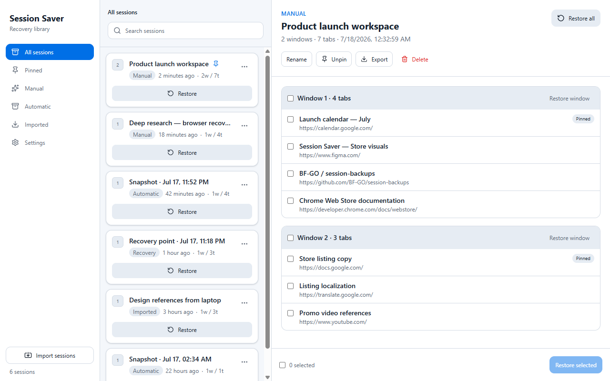
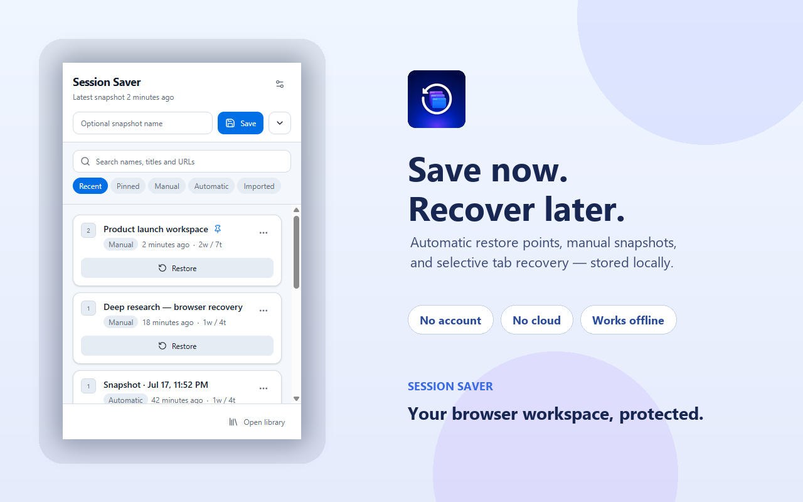
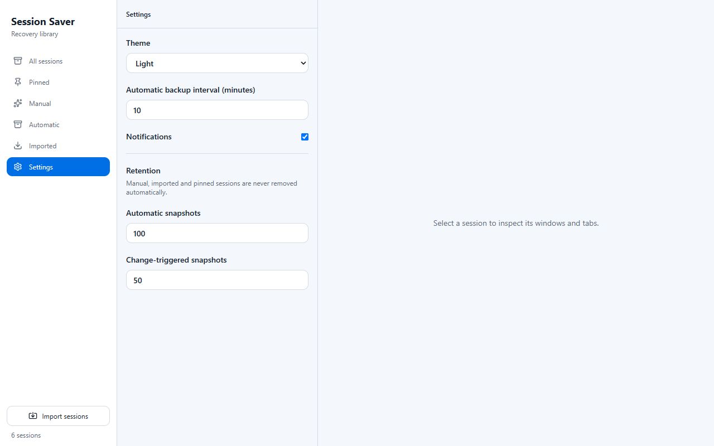

# Session Saver

[](https://github.com/BF-GO/session-backups/actions/workflows/ci.yml)
[](LICENSE)

Session Saver is a Chrome extension that creates local recovery points for browser windows and tabs, so a closed workspace can be restored without an account, cloud service, or browsing-history upload.

**Browser:** Google Chrome · **Privacy:** data stays in `chrome.storage.local` · **Status:** actively maintained · **Download:** [latest GitHub release](https://github.com/BF-GO/session-backups/releases/latest)



## Features

- Automatic and change-triggered recovery points.
- Named manual snapshots for important workspaces.
- Whole-session, per-window, and selective tab restore.
- Pinned tabs and supported Chrome Tab Groups.
- Local search, filters, pinning, retention controls, and themes.
- Validated JSON import with merge or replace behavior.
- Portable JSON export for user-selected sessions.
- Safe, retryable migration from Session Saver v1.7.

<details>
<summary>More product screenshots</summary>





</details>

## Privacy and permissions

Session Saver has no account system, analytics, telemetry, backend, remote scripts, or host permissions. Runtime session data is stored locally by Chrome. Exported JSON files contain the URLs and titles selected by the user and should be handled as sensitive data. See [PRIVACY.md](PRIVACY.md) for the complete boundary.

| Permission      | Purpose                                                                |
| --------------- | ---------------------------------------------------------------------- |
| `tabs`          | Read tab URL, title, order, pinned state, and restore tabs             |
| `storage`       | Store sessions, settings, schema version, and migration state locally  |
| `alarms`        | Create automatic recovery points while the service worker is suspended |
| `notifications` | Optionally confirm successful automatic snapshots                      |
| `tabGroups`     | Capture and recreate supported Chrome Tab Groups                       |

## Install

Session Saver is not currently published in the Chrome Web Store.

1. Download `session-saver-2.0.0-chrome.zip` from the [latest release](https://github.com/BF-GO/session-backups/releases/latest).
2. Verify the archive against the attached `.sha256` file.
3. Extract the archive to a permanent local folder.
4. Open `chrome://extensions`, enable **Developer mode**, choose **Load unpacked**, and select the extracted folder.

## Architecture and data safety

The current extension is built with WXT, React, strict TypeScript, Tailwind CSS, Zod, and Manifest V3. Popup and library pages communicate with the background service worker through typed messages. Domain operations pass through a storage repository that validates schema v2 before every write.

- [Architecture](docs/architecture.md)
- [Storage schema](docs/storage-schema.md)
- [v1.7 to v2 migration](docs/migration-v1-v2.md)
- [Threat model](docs/threat-model.md)

The original v1.7 source is not part of the current build or `main` tree. It remains available as migration evidence in the [`pre-releases` history at commit `128729d`](https://github.com/BF-GO/session-backups/tree/128729d).

## Development

Prerequisites: Node.js 24 and npm.

```sh
git clone https://github.com/BF-GO/session-backups.git
cd session-backups
npm ci
npm run dev
```

The production Chrome MV3 build is written to `.output/chrome-mv3`.

## Quality commands

```sh
npm run typecheck
npm run lint
npm run format:check
npm run test
npm run test:coverage
npm run build
npm run zip
npm run check
```

Tests cover import validation, repository writes, migration verification and retry, retention, hashing, and restore planning/browser interactions. CI runs the complete suite from a clean checkout and publishes an installable ZIP artifact.

## Releases

`package.json` is the version source of truth; WXT derives the extension manifest version from it. Pushing a matching `v*` tag or manually running the release workflow repeats all quality checks, builds the Chrome ZIP, calculates SHA-256, and attaches both files to a GitHub Release. Chrome Web Store publishing remains a separate reviewed process.

See [CHANGELOG.md](CHANGELOG.md) for release notes.

## Limitations

- Google Chrome is the only tested browser.
- Data is local to the Chrome profile and is not synchronized between devices.
- Uninstalling the extension may remove its local storage.
- Exports are plain JSON and are not encrypted.
- Some browser-internal or local-file URLs remain subject to Chrome restrictions.
- Change-triggered snapshots use a short in-memory debounce and may be skipped if Chrome terminates the service worker immediately after an event; scheduled snapshots use `chrome.alarms`.

## Contributing and security

Contributions are welcome through [CONTRIBUTING.md](CONTRIBUTING.md). Report vulnerabilities privately as described in [SECURITY.md](SECURITY.md); do not publish exploit details in a public issue.

Session Saver is available under the [MIT License](LICENSE).
