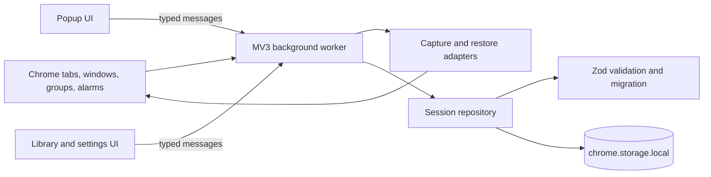

# Architecture

Session Saver v2 is a WXT Manifest V3 extension with three entry points:

- `background.ts`: service-worker lifecycle, alarms, browser event listeners, typed request handling, capture, repository access, and restore orchestration;
- `popup/`: quick save, recent sessions, search, and navigation to the full library;
- `library/`: session browsing, selective restore, import/export, and settings. There is no separate options page.

## Boundaries

UI components render data and issue typed commands; they do not write Chrome storage directly. The background worker owns browser API access. `SessionRepository` serializes writes, applies retention, validates imports, remaps imported identifiers, and validates the complete storage state before persistence.

Pure domain helpers handle import inspection, hashing, retention, and restore planning. Browser-specific functions receive their validated output and call Chrome APIs.

## Capture flow

1. A manual request, alarm, or relevant browser event asks the background worker for a snapshot.
2. The collector reads Chrome windows, tabs, and supported groups.
3. A deterministic hash identifies an unchanged automatic/change state.
4. The repository validates the normalized session, applies retention, and writes schema v2.

## Restore flow

1. The repository loads a validated session.
2. A pure restore plan applies window/tab selection, orders tabs by saved index, removes unsupported URLs, and enforces the 2000-tab operation limit.
3. Chrome windows are created in saved order.
4. Pinned and active state are applied to returned tab IDs.
5. Supported groups are recreated from the saved-to-created tab mapping.
6. Partial browser API failures are reported in `RestoreResult` without hiding successful work.

## Service-worker suspension

The background process is not assumed to remain alive. Persistent state lives in `chrome.storage.local`, and scheduled snapshots use `chrome.alarms`. Startup and installation handlers initialize storage and reschedule the alarm. The one-second change-event debounce is intentionally in memory and best-effort; a worker termination can discard a pending debounce, but it cannot corrupt persisted state.

## Validation points

- Capture and repository writes use strict schema v2 validation.
- Import text is size-checked and parsed before preview, then validated again by the repository.
- Existing storage is validated or migrated before use.
- New storage is read and verified before legacy keys are deleted.
- Restore planning validates URL schemes again before browser calls.
